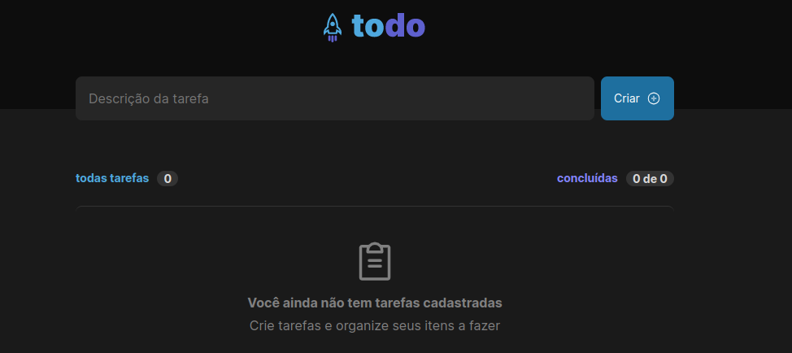
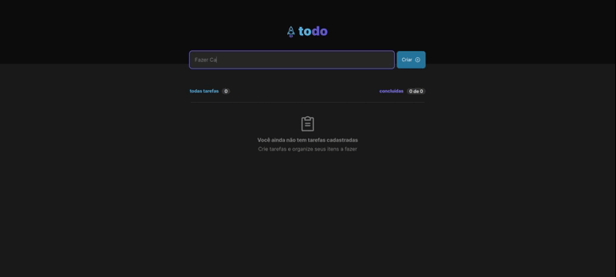

 <h1 align="center" height="150px" back-ground="black">
 
 </h1>

## Índice

- [📜 Sobre ](#📜-sobre)

- [🚀 Tecnologias](#🚀-tecnologias)

<br><br><br>

<h2 align="center"> <a href="https://todolist3d.vercel.app/">To todoList</a> </h2><br><br>
 <div align="center">

 </div>
<br><br><br>

---

## 📜 Sobre

**Primeiro desafio da rocketseat 🚀 do curso de ignite trilha react 2022**, veja
o layout
[clicando aqui](<https://www.figma.com/file/cSGrb0UlBERzP9IpewlBNA/ToDo-List-(Copy)?node-id=0-1&t=tLzX4zE7h16aWyn9-0>).Veja
o projeto online [clicando aqui](https://todolist3d.vercel.app/).

---

<br><br><br>

## 🚀 Tecnologias

<br>


---

<br><br><br>

## 🚀 Dependências

<br>

  ```Typescript
 "dependencies": {
    "@phosphor-icons/react": "^2.0.8",
    "react": "^18.2.0",
    "react-dom": "^18.2.0",
    "uuid": "^9.0.0"
  }
```